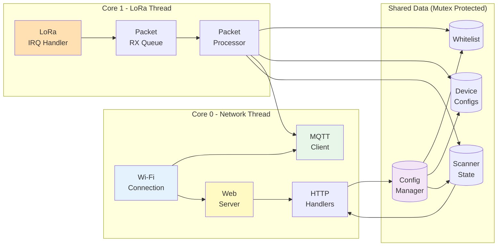

```mermaid
graph LR
    subgraph "Core 0 - Network Thread"
        A[Wi-Fi<br/>Connection]
        B[MQTT<br/>Client]
        C[Web<br/>Server]
        D[HTTP<br/>Handlers]
        
        A --> B
        A --> C
        C --> D
    end
    
    subgraph "Core 1 - LoRa Thread"
        E[LoRa<br/>IRQ Handler]
        F[Packet<br/>RX Queue]
        G[Packet<br/>Processor]
        
        E --> F
        F --> G
    end
    
    subgraph "Shared Data (Mutex Protected)"
        H[(Config<br/>Manager)]
        I[(Whitelist)]
        J[(Device<br/>Configs)]
        K[(Scanner<br/>State)]
        
        H --> I
        H --> J
        H --> K
    end
    
    G --> I
    G --> J
    G --> B
    G --> K
    D --> H
    K --> D
    
    style A fill:#e3f2fd
    style B fill:#e8f5e9
    style C fill:#fff9c4
    style E fill:#ffe0b2
    style H fill:#f3e5f5
```
