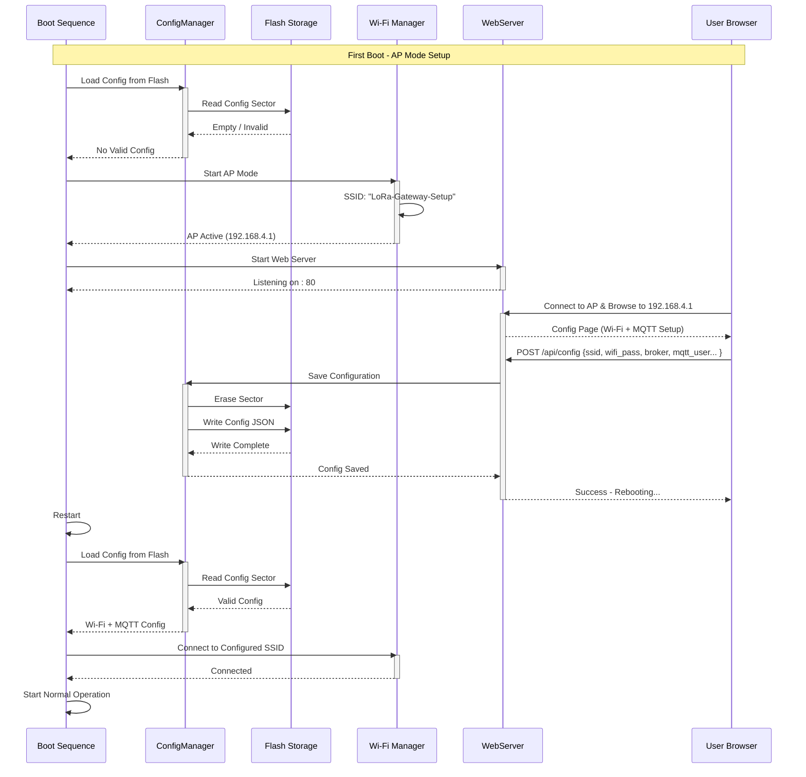

```mermaid
sequenceDiagram
    participant Boot as Boot Sequence
    participant Cfg as ConfigManager
    participant Flash as Flash Storage
    participant WiFi as Wi-Fi Manager
    participant Web as WebServer
    participant User as User Browser

    Note over Boot,User: First Boot - AP Mode Setup

    Boot->>Cfg: Load Config from Flash
    activate Cfg
    Cfg->>Flash: Read Config Sector
    Flash-->>Cfg: Empty / Invalid
    Cfg-->>Boot: No Valid Config
    deactivate Cfg

    Boot->>WiFi: Start AP Mode
    activate WiFi
    WiFi->>WiFi:  SSID:  "LoRa-Gateway-Setup"
    WiFi-->>Boot: AP Active (192.168.4.1)
    deactivate WiFi

    Boot->>Web: Start Web Server
    activate Web
    Web-->>Boot:  Listening on : 80
    deactivate Web

    User->>Web: Connect to AP & Browse to 192.168.4.1
    activate Web
    Web-->>User: Config Page (Wi-Fi + MQTT Setup)

    User->>Web: POST /api/config {ssid, wifi_pass, broker, mqtt_user... }
    Web->>Cfg: Save Configuration
    activate Cfg
    Cfg->>Flash:  Erase Sector
    Cfg->>Flash: Write Config JSON
    Flash-->>Cfg: Write Complete
    Cfg-->>Web: Config Saved
    deactivate Cfg
    
    Web-->>User: Success - Rebooting... 
    deactivate Web

    Boot->>Boot: Restart
    Boot->>Cfg: Load Config from Flash
    activate Cfg
    Cfg->>Flash: Read Config Sector
    Flash-->>Cfg: Valid Config
    Cfg-->>Boot: Wi-Fi + MQTT Config
    deactivate Cfg

    Boot->>WiFi: Connect to Configured SSID
    activate WiFi
    WiFi-->>Boot: Connected
    deactivate WiFi

    Boot->>Boot: Start Normal Operation
```
