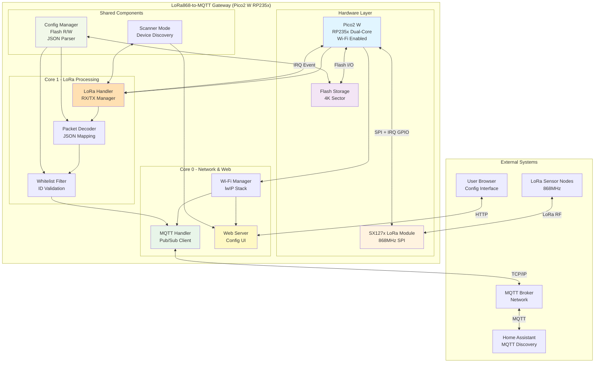
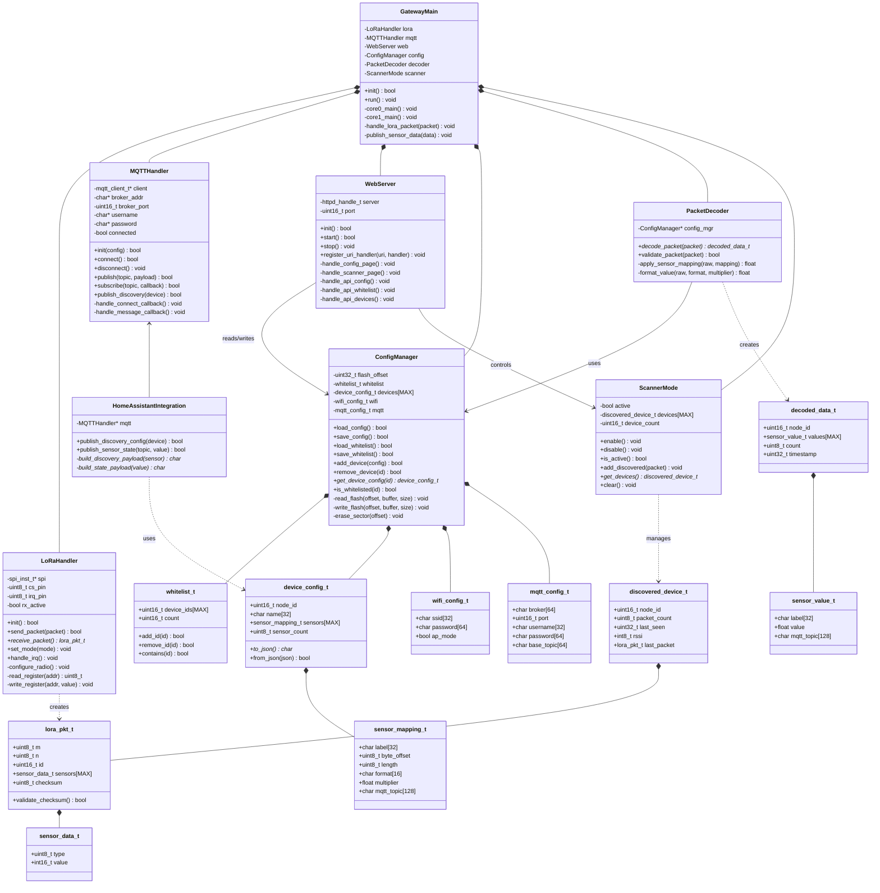
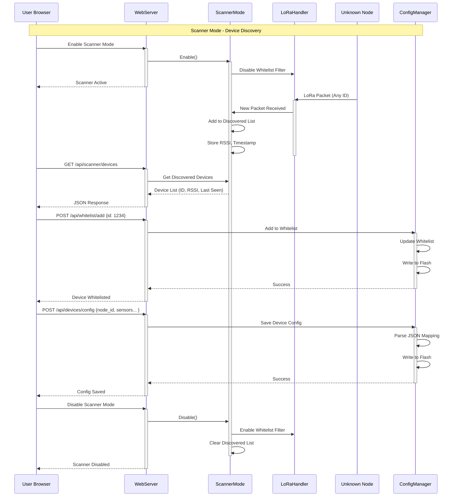
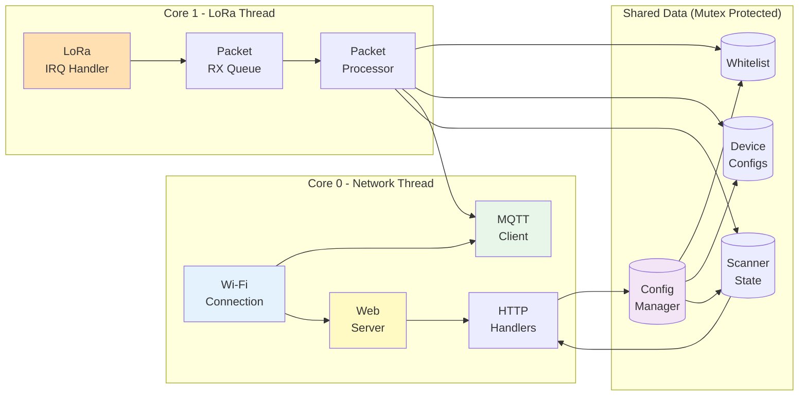

# LoRa868-to-MQTT Gateway Architecture

This document describes the system architecture for the LoRa868-to-MQTT Gateway project.

## System Block Diagram



## UML Class Diagram



## Normal Operation Sequence

```mermaid
sequenceDiagram
    participant Node as LoRa Node
    participant SX127x as SX127x Module
    participant LoRa as LoRaHandler
    participant Dec as PacketDecoder
    participant WL as Whitelist
    participant MQTT as MQTTHandler
    participant Broker as MQTT Broker
    participant HA as Home Assistant

    Note over Node,HA: Normal Operation - Whitelisted Device

    Node->>SX127x:  Transmit LoRa Packet (868MHz)
    SX127x->>LoRa: IRQ Trigger (RX Complete)
    activate LoRa
    
    LoRa->>LoRa: Read Packet via SPI
    LoRa->>LoRa: Validate Checksum
    LoRa->>WL: Check if ID Whitelisted
    activate WL
    
    alt Device Whitelisted
        WL-->>LoRa: ✓ Approved
        deactivate WL
        LoRa->>Dec: Pass Packet for Decoding
        activate Dec
        
        Dec->>Dec: Load Device Config from Flash
        Dec->>Dec:  Apply Sensor Mappings
        Dec->>Dec:  Convert Raw Values (multiplier)
        Dec-->>LoRa: Return Decoded Data
        deactivate Dec
        
        LoRa->>MQTT: Publish Sensor Data
        deactivate LoRa
        activate MQTT
        
        loop For Each Sensor
            MQTT->>Broker:  PUBLISH lora/sensor/1234/temperature
            Broker->>HA: Forward Message
            HA->>HA: Update Entity State
        end
        
        deactivate MQTT
        
    else Device Not Whitelisted
        WL-->>LoRa:  ✗ Rejected
        deactivate WL
        LoRa->>LoRa: Drop Packet
        deactivate LoRa
    end
```

## Scanner Mode Sequence



## Component Interaction



## Key Design Principles

1. **Dual-Core Architecture**
   - **Core 0:** Handles Wi-Fi, MQTT, and Web Server
   - **Core 1:** Handles LoRa packet processing

2. **Flash-Based Persistence**
   - Configuration stored in 4K flash sector
   - Whitelist and device configs persisted across reboots

3. **Security by Whitelist**
   - Only configured device IDs are processed
   - Scanner mode for easy onboarding

4. **Flexible Sensor Mapping**
   - JSON-based configuration per device
   - Support for various data formats and multipliers

5. **Home Assistant Integration**
   - MQTT Discovery for automatic sensor creation
   - State updates published to configured topics

---

**Generated:** 2025-12-12  
**Project:** LoRa868-to-MQTT Gateway